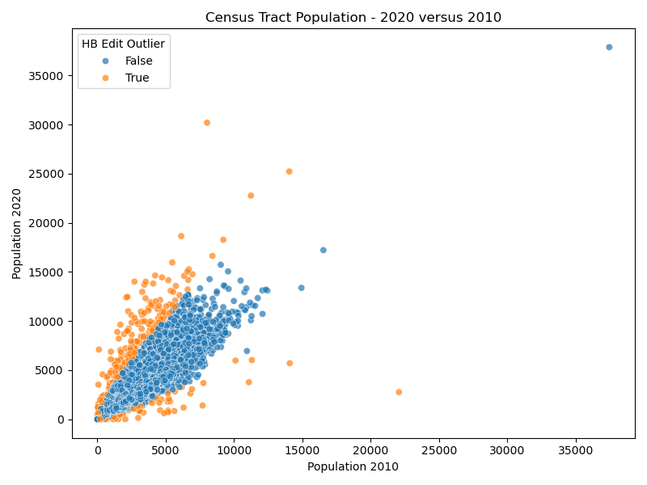

## Background

The Hidiroglou‑Berthelot method, or HB‑edit, was introduced by Hidiroglou and Berthelot in 1986 to enhance outlier detection in periodic business surveys, particularly where units (e.g. companies, survey respondents) exhibit wide variations in size. Detecting outliers in survey data can be difficult due to the extreme variation in the size of respondents. Traditional methods with fixed-thresholds like z-scores or IQR can fail because they ignore scale heterogeneity.


1. For each entity $i$, compute the **ratio** of its current value $x_i(t)$ to its previous value $x_i(t-1)$:  

   $$r_i = \frac{x_i(t)}{x_i(t-1)}$$

2. Center these ratios around their **median** $r_{Q_2}$ (also referred as $r_{M}$) through a transformation generating $s_i$, which becomes symmetric around zero. This transformation expresses deviation from the median ratio on a symmetric scale, where 0 represents 'typical' change.

   $$
   s_i =
   \begin{cases}
   1 - \frac{r_{Q_2}}{r_i}, & \text{if } 0 < r_i < r_{Q_2}, \\
   \frac{r_i}{r_{Q_2}} - 1, & \text{if } r_i \geq r_{Q_2}
   \end{cases}
   $$


Then, to account for the size of the observation the HB method creates an effects vector, $e_i$, by scaling the symmetric ratios as follows:

3. Incorporate the **size** of the unit—by taking the maximum of $x_i(t)$ and $x_i(t-1)$, raised to the power of a tuning parameter $u$ (between 0 and 1)—to compute the **effect score**:  

   $$e_i = s_i \times \bigl[\max(x_i(t), \ x_i(t-1))\bigr]^u, \text{ where } 0 \le u \le 1$$

   - Larger units require smaller relative changes to be flagged as outliers.  
   - Smaller units tolerate proportionally larger fluctuations.  

This is the core innovation of HB-edit. It couples relative change with unit size.

4. Define outlier boundaries based on percentiles of the $e_i$ distribution. Typically:  

   $$[e_M - c \times d_{Q1},\; e_M + c \times d_{Q3}]$$

   where:  
   - $e_{M}$ is the median of $e_i$;  
   - $e_{Q1}$ is the first quartile of $e_i$
   - $e_{Q3}$ is the third quartile of $e_i$
   - $a$ is a small constant (commonly 0.05)
   - $c$ scales how wide these bounds are (commonly 4–7)
   - $d_{Q1} = \max(e_{M} - e_{Q1}, | a \times e_{M}|)$
   - $d_{Q3} = \max(e_{Q3} - e_{M}, | a \times e_{M}|)$

Units whose $e_i$ fall outside this interval are flagged as outliers.

## Why Is HB-edit Useful?

- **Size-aware flexibility**: By incorporating unit size via $u$, the method adjusts tolerance for change.  
- **Symmetric detection**: Captures both unusually large and unusually small changes.  
- **Data-driven, nonparametric**: No strong distributional assumptions.  
- **Adjustable sensitivity**: Parameters $u$, $a$, and $c$ allow analysts to tune sensitivity.

## Assumptions & Practical Considerations

**Key assumptions and caveats:**
- It assumes the values $x_i(t)$ and $x_i(t-1)$ are temporally comparable, or at least correlated
- Ratio-of-change distribution should be smooth and roughly symmetric.  
- Parameter tuning requires care—defaults are often $u = 0.4$, $a = 0.05$, $c = 4$–7.  
- Many identical ratios can cause quartile issues—percentiles (e.g. 10th & 90th) may work better.  
- HB-edit is **univariate**; multivariate anomaly detection requires different methods.

**Practical workflow:**

1. Plot the distribution of $e_i$ scores.  
2. Experiment with parameter values.  
3. Use adjusted boxplots or other robust diagnostics.  
4. Always review flagged outliers in context.

## Summary Table: HB-edit Snapshot

| Element              | Description |
|----------------------|-------------|
| **Ratio $r_i$**        | Change between periods |
| **Centered $s_i$**     | Symmetric score around median |
| **Effect $e_i$**       | Size-weighted score |
| **Parameters**         | $u, a, c$ for tuning |
| **Bounds**             | Median-based, robust intervals |
| **Use Cases**          | Surveys, business data |
| **Strengths**          | Size-aware, symmetric, flexible |
| **Limitations**        | Needs tuning, univariate only |

## Final Thoughts

The **Hidiroglou-Berthelot (HB-edit) method** is a robust and interpretable tool for outlier detection—especially well-suited for longitudinal survey or administrative data where units vary widely in size. With careful parameter tuning and visualization, HB-edit highlights meaningful anomalies without overwhelming analysts with false positives.

## Demonstration

To demonstrate this method I am going to use the 2020 and 2010 Census tract-level population estimates. Code to create this dataset from the Census API is available in the spoiler below:

<details>
<summary>Click to view code</summary>

```python
import requests
import pandas as pd
from tqdm import tqdm

state_fips = [f"{i:02d}" for i in range(1, 57) if i not in {3, 7, 14, 43, 52}]

def fetch_tracts(year, var, base):
    """
    Fetch tract-level totals for all states for a given year.
    year: 2010 or 2020 (only used for clarity)
    var:  'P001001' (2010) or 'P1_001N' (2020)
    base: 'https://api.census.gov/data/2010/dec/sf1' or 'https://api.census.gov/data/2020/dec/pl'
    """
    frames = []
    states = [f"{i:02d}" for i in range(1, 57) if i not in {3, 7, 14, 43, 52}]

    for st in tqdm(states, desc=f"Downloading {year} tracts"):
        # Example:
        # .../data/2020/dec/pl?get=NAME,P1_001N&for=tract:*&in=state:01&in=county:*
        url = f"{base}?get=NAME,{var}&for=tract:*&in=state:{st}&in=county:*"
        response = requests.get(url, timeout=120)
        response.raise_for_status()
        data = response.json()
        df = pd.DataFrame(data[1:], columns=data[0])
        # Ensure numeric population
        df[var] = pd.to_numeric(df[var], errors="coerce")
        frames.append(df)

    if not frames:
        return pd.DataFrame(columns=["NAME", var, "state", "county", "tract"])

    out = pd.concat(frames, ignore_index=True)
    return out

# -------- fetch --------
# 2010 Decennial SF1, total population P001001
df10_raw = fetch_tracts(
    year=2010,
    var="P001001",
    base="https://api.census.gov/data/2010/dec/sf1"
)

# 2020 PL 94-171, total population P1_001N
df20_raw = fetch_tracts(
    year=2020,
    var="P1_001N",
    base="https://api.census.gov/data/2020/dec/pl"
)

# -------- tidy + merge --------
df10 = df10_raw.rename(columns={"P001001": "POP_2010"})
df20 = df20_raw.rename(columns={"P1_001N": "POP_2020"})

# Keep consistent keys
keep_cols = ["NAME", "state", "county", "tract"]
df10 = df10[keep_cols + ["POP_2010"]]
df20 = df20[keep_cols + ["POP_2020"]]

# Merge on tract FIPS (state+county+tract) and NAME
tracts = df10.merge(df20, on=["state", "county", "tract", "NAME"], how="outer")

# Optional: build a full 11-digit tract GEOID (2 state + 3 county + 6 tract)
tracts["GEOID"] = tracts["state"].str.zfill(2) + tracts["county"].str.zfill(3) + tracts["tract"].str.zfill(6)

# Reorder columns nicely
tracts = tracts[["GEOID", "NAME", "state", "county", "tract", "POP_2010", "POP_2020"]]
```
</details>


```python
import numpy as np

def hidiroglou_berthelot_outliers(y_k, x_k, u = 0.5, a = 0.05, c = 4, quantile_lo = 0.25, quantile_hi = 0.75, verbose = False):
    """
    Hidiroglou-Berthelot Method (...) for Outliers.

    Assume numerator and denominator are same length.

    Parameters
    ----------
    y_k : 1D data
        Data to test.
    x_k : 1D data
        Data to test.
    u : float
        Parameter. Controls curve of final boundaries. Commonly (u = 0.50)
    a : float
        Parameter. Ensures upper and ower bounds are not arbitrarily close to the median. (a = 0.05)
    c : float
        Parameter. Controls the width of the acceptance region. (c = 4)
    quantlie_lo : float
        Parameter. Optional quantile for lower bound of effects vector. Usually 25th percentile, but could be 10th.
    quantlie_lo : float
        Parameter. Optional quantile for lower bound of effects vector. Usually 75th percentile, but could be 90th.

    Returns
    -------
    outliers : ndarray of bool, shape (n,)
        Boolean mask indicating which points in `data` are considered outliers. 
        True for detected outliers, False otherwise (including NaNs).

    References
    ----------
    Hidiroglou, M.A., and Berthelot, J.-M. (1986). ”Statistical Editing and Imputation for Periodic Business Surveys”. Survey Methodology, 12, 73-83.
    """
    y_k = np.array(y_k)
    x_k = np.array(x_k)

    # Check length
    if y_k.shape[0] != x_k.shape[0]:
        raise ValueError(f"y_k and x_k must be the same length. Got lengths: {len(y_k)} and {len(x_k)}")

    # Ignore NaNs and zeros
    valid = (x_k != 0) & (y_k != 0) & ~np.isnan(x_k) & ~np.isnan(y_k)

    # Ratio
    r_k = y_k[valid] / x_k[valid]

    # Ratio Median
    r_Q2 = np.quantile(r_k, 0.50)

    # Centering transformation
    s_k = np.where(
        (r_k < r_Q2) & (r_k > 0),
        1 - (r_Q2 / r_k), # 0 < r_k < r_Q2
        (r_k / r_Q2) - 1  # Otherwise
    )

    # Effects vector
    e_k = s_k * np.maximum(x_k[valid], y_k[valid])**u
    
    e_Q1 = np.quantile(e_k, quantile_lo) 
    e_Q2 = np.quantile(e_k, 0.50) 
    e_Q3 = np.quantile(e_k, quantile_hi) 

    # Upper and Lower HB Bounds
    bound_lo = e_Q2 - c * max(e_Q2 - e_Q1, a * np.abs(e_Q2))
    bound_hi = e_Q2 + c * max(e_Q3 - e_Q2, a * np.abs(e_Q2))

    # Masks effects vectors as outliers
    outlier_effects = (e_k < bound_lo) | (e_k > bound_hi)

    # Creates mask like original length of data
    outliers = np.full_like(x_k, False, dtype = bool)
    outliers[valid] = outlier_effects
    return outliers
```


```python
import pandas as pd
import seaborn as sns
import matplotlib.pyplot as plt

df = pd.read_csv("census_tract_population_2010_2020.csv").dropna()
df = df[(df["POP_2010"] > 0) & (df["POP_2020"] > 0)]

df["hb_edit_outliers"] = hidiroglou_berthelot_outliers(
    df["POP_2020"],
    df["POP_2010"],
    u=0.5, a=0.05, c=10, quantile_lo=0.1, quantile_hi=0.9
)

plt.figure(figsize=(8, 6))

sns.scatterplot(
    data=df,
    x="POP_2010",
    y="POP_2020",
    hue="hb_edit_outliers",
    alpha=0.7
)

plt.title("Census Tract Population - 2020 versus 2010")
plt.xlabel("Population 2010")
plt.ylabel("Population 2020")

plt.legend(title="HB Edit Outlier")
plt.tight_layout()

plt.savefig("census_scatter.png")
plt.close()
```



## An Object-Oriented Estimator

In the code below you can find the source for a python object with the additional capability of returning the bounds for plotting or evaluating your parameter choices.

<details>
<summary>Click to view code</summary>

```python
import numpy as np
class HidiroglouBerthelotOutlierDetector:
    """
    Hidiroglou-Berthelot Method (...) for Outliers.

    Parameters
    ----------
    y_k : 1D data
        Data to test. Numerator.
    x_k : 1D data
        Data to test. Denominator.
    u : float, default=0.50
        Parameter. Controls curve of final boundaries. Commonly (u = 0.50)
    a : float, default=0.05
        Parameter. Ensures upper and ower bounds are not arbitrarily close to the median. (a = 0.05)
    c : float, default=4
        Parameter. Controls the width of the acceptance region. (c = 4)
    Q1 : float, default=0.25
        Upper quantile for effects vector (usually 0.25, alternative is 0.10).
    Q3 : float, default=0.75
        Upper quantile for effects vector (usually 0.75, alternative is 0.90).

    Returns
    -------
    outliers : ndarray of bool, shape (n,)
        Boolean mask indicating which points in `data` are considered outliers. 
        True for detected outliers, False otherwise (including NaNs).

    References
    ----------
    Hidiroglou, M.A., and Berthelot, J.-M. (1986). "Statistical Editing and Imputation for Periodic Business Surveys". Survey Methodology, 12, 73-83.
    Winkler, McDowney, Cowles, Yildiz1, Steiner and Mukhopadhyay. "Evaluating the Hidiroglou-Berthelot Method for Survey Data Collected by the US EIA"
    Belcher (2003). "APPLICATION OF THE HIDIROGLOU-BERTHELOT METHOD OF OUTLIER DETECTION FOR PERIODIC BUSINESS SURVEYS"
    https://www150.statcan.gc.ca/n1/en/pub/12-001-x/1986001/article/14442-eng.pdf?st=GapZFThG
    https://ssc.ca/sites/default/files/survey/documents/SSC2003_R_Belcher.pdf
    http://www.asasrms.org/Proceedings/y2023/files/HB_JSM_2023.pdf
    """
    def __init__(self, u=0.5, a=0.05, c=4, Q1=0.25, Q3=0.75):
        """
        Initialize detector parameters.
        """
        self.u = u
        self.a = a
        self.c = c
        self.Q1 = Q1
        self.Q3 = Q3

        # Attributes to be set during fit
        self.outliers = None
        self.r_M = None
        self.LB = None
        self.UB = None
        self.e_Q1 = None
        self.e_Q2 = None
        self.e_Q3 = None
        self.s_k = None
        self.e_k = None
        # Attributes to be set during bounds
        self.bounds_lower = None
        self.bounds_upper = None

    def fit(self, y_k, x_k):
        """
        Fit the model and detect outliers.
        """
        y_k = np.array(y_k).astype(float)
        x_k = np.array(x_k).astype(float)

        # Check length
        if y_k.shape[0] != x_k.shape[0]:
            raise ValueError(f"y_k and x_k must be the same length. Got lengths: {len(y_k)} and {len(x_k)}")

        # Ignore NaNs and zeros
        valid = (x_k != 0) & (y_k != 0) & ~np.isnan(x_k) & ~np.isnan(y_k)

        # Ratio
        r_k = y_k[valid] / x_k[valid]

        # Ratio Median
        r_Q2 = np.quantile(r_k, 0.50)

        # Centering transformation
        s_k = np.where(
            (r_k < r_Q2) & (r_k > 0),
            1 - (r_Q2 / r_k), # 0 < r_k < r_Q2
            (r_k / r_Q2) - 1  # Otherwise
        )

        # Effects vector
        e_k = s_k * np.maximum(x_k[valid], y_k[valid])**self.u
        
        e_Q1 = np.quantile(e_k, self.Q1) 
        e_Q2 = np.quantile(e_k, 0.50) 
        e_Q3 = np.quantile(e_k, self.Q3) 

        # Upper and Lower HB Bounds
        bound_lo = e_Q2 - self.c * max(e_Q2 - e_Q1, np.abs(self.a * e_Q2))
        bound_hi = e_Q2 + self.c * max(e_Q3 - e_Q2, np.abs(self.a * e_Q2))

        # Masks effects vectors as outliers
        outlier_effects = (e_k < bound_lo) | (e_k > bound_hi)

        # Creates mask like original length of data
        outliers = np.full_like(x_k, False, dtype = bool)
        outliers[valid] = outlier_effects

        self.outliers = outliers
        self.r_M = r_Q2
        self.LB = bound_lo
        self.UB = bound_hi

        self.e_k  = e_k
        self.s_k  = s_k
        self.e_Q1 = e_Q1
        self.e_Q2 = e_Q2
        self.e_Q3 = e_Q3

        return self

    def get_bounds(self, denominator, tol = 1, max_iter = 100, verbose = False):
        """
        Calculate upper and lower HB bounds for a given denominator vector.
        """
        if (self.r_M is None) or (self.LB is None) or (self.UB is None):
            raise ValueError("Must fit detector before calculating bounds.")

        denominator = np.array(denominator).astype(float)

        # Lower Boundary
        boundary_lower = self.r_M * (denominator) / (1 - (self.LB/(denominator)**self.u) )

        # Upper Boundary
        x_n = denominator # init
        for iter in range(max_iter):
            f_x  = (
                ( x_n**(self.u+1) ) 
                - ( denominator * self.r_M * (x_n**self.u) ) 
                - ( self.UB * denominator * self.r_M ) 
            )
            f1_x = (
                ( (self.u + 1) * (x_n**self.u) ) 
                - ( self.u * denominator * self.r_M * (x_n**(self.u - 1)) )
            )
            x_n1 = x_n - (f_x / f1_x)

            diff = np.max(np.abs(x_n1 - x_n))
            x_n = x_n1 # next iter
            if diff <= tol:
                break
        boundary_upper = x_n
        #
        if verbose:
            print(f"Final tol was {diff:,.2f} after {iter} iterations.")
        self.bounds_lower = boundary_lower
        self.bounds_upper = boundary_upper

        return self
```

## References

- [Hidiroglou, M.A., and Berthelot, J.-M. (1986). "Statistical Editing and Imputation for Periodic Business Surveys". Survey Methodology, 12, 73-83.](https://www150.statcan.gc.ca/n1/en/pub/12-001-x/1986001/article/14442-eng.pdf?st=GapZFThG)
- [Winkler, McDowney, Cowles, Yildiz1, Steiner and Mukhopadhyay. "Evaluating the Hidiroglou-Berthelot Method for Survey Data Collected by the US EIA"](https://ssc.ca/sites/default/files/survey/documents/SSC2003_R_Belcher.pdf)
- [Belcher (2003). "APPLICATION OF THE HIDIROGLOU-BERTHELOT METHOD OF OUTLIER DETECTION FOR PERIODIC BUSINESS SURVEYS"](http://www.asasrms.org/Proceedings/y2023/files/HB_JSM_2023.pdf)
