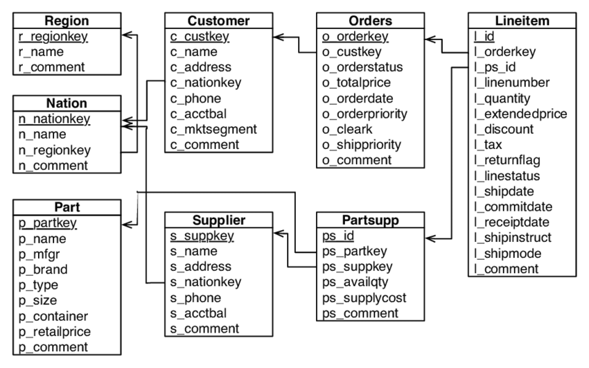

https://duckdb.org/docs/stable/core_extensions/overview

## Background

The Transaction Processing Performance Council ([TPC](https://www.tpc.org/)) is a non-profit that defines database benchmarking standards. TPC benchmarks like TPC-H and TPC-DS are industry-standard big-data benchmarks. 

These benchmarks are generated data using the dbgen or dsgen tools. These tools, while free, require registering an email and compiling it with gcc. As an alternative, however, you could use DuckDB which includes TPC-DS and TPC-H generating extensions by default as part of their core extensions.

Ever wanted to generate terabytes of data simulating a mock data-warehouse for benchmarking or practice? DuckDB makes it as easy as calling:

```
CALL dbgen(sf = 100);
```

The TPC tools generate data using configurable *scale factors* (sf) where:

    SF = 1 ≈ 1 GB

    SF = 100 ≈ 100 GB

    SF = 1000 ≈ 1 TB

And if you call it using an on-disk database then it begins working directly there, avoiding memory issues.

The TPC-H represents a business environment and consists of 8 separate tables in the following schema: 


The TPC-DS is more complex and represents something like a retail product suppliers decision support system and contains 7 fact tables and 17 dimensions.


Ever wanted to try testing duckdb, dask, spark, polars, or any other big-name frameworks in industry-typical scenarios? DuckDB provides an easy solution as well as a scalable reference point.